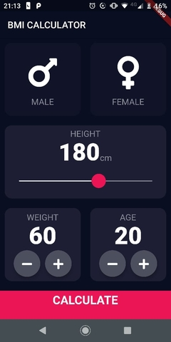
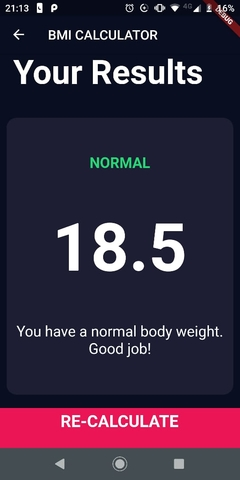

# BMI Calculator App

>A Flutter App calculate your body mass index (BMI). 

## Table of contents
* [General info](#general-info)
* [Screenshots](#screenshots)
* [Files](#files)
* [Technologies](#technologies)
	* [Dart Packages](#packages)
	* [How to use the reasuble widgets](#how-to-use-the-reasuble-widgets)
	* [How it works?](#how-it-works)
* [Setup](#setup)

## General info
My intention in creating this app was understating how the widgets work in Flutter and how can you structured the application. Also, learn more about Flutter.

## Screenshots

    

## Files

>The file Components have all the reusable widgets that I use on the screens.

    | Components
    |---- buttom_bottom.dart
    |---- icon_content.dart
    |---- reasuble_card.dart
    |---- round_icon_buttom.dart
    | Screens
    |---- input_page.dart
    |---- result._page.dart
    |-----calculator.dart
    | calculator_brain.dart
    | constants.dart
    | main.dart

## Technologies

 - Dart - version 2.8.0
 - Flutter
### Packages
* font_awesome_flutter
	* version: 8.5.0

### How to use the reusable widgets
 Component | Description
 ---------------|-----------------
BottomButtom | It´s a StatelessWidget that requires a Function (_onTap_) to execute as a callback  and String (_buttomTitle_)
ReusableCard | It´s a StatelessWidget that requires a Function (_onPress_) to execute as a callback, a Widget (_cardChild_) to choose which widget put inside the gestureDetector .And at last a Color(_colour_)
IconContent| It´s a StatelessWidget that requires a String (_textIcon_) and a IconData(_iconButtom_)
RoundIconButton | It´s a StatelessWidget that requires a Function (_changeWeight_) and a IconData(_icon_)

### How it works?

Well, let´s start with the calculator_brain.dart, there I created a class CalculatorBrain that receives two parameters height and weight and with them, calc the BMI. The CalculatorBrain also has the methods 'getInterpretation and getResults' for return a message to the user and the result of the calc like 'Normal or Overweight'.
 
## Setup
>If you´re using the android studio code, and already install the Dart and Flutter on your SO and the plugins on android studio, just open the android studio and click on **Check out project from Version Control** and choose the option **Git**. After that, on the input called **URL** paste the URL of this project and click **Clone**.
>When you open the project, you must import the dependencies before running the project.
>After that, just choose your device and click **Run**
